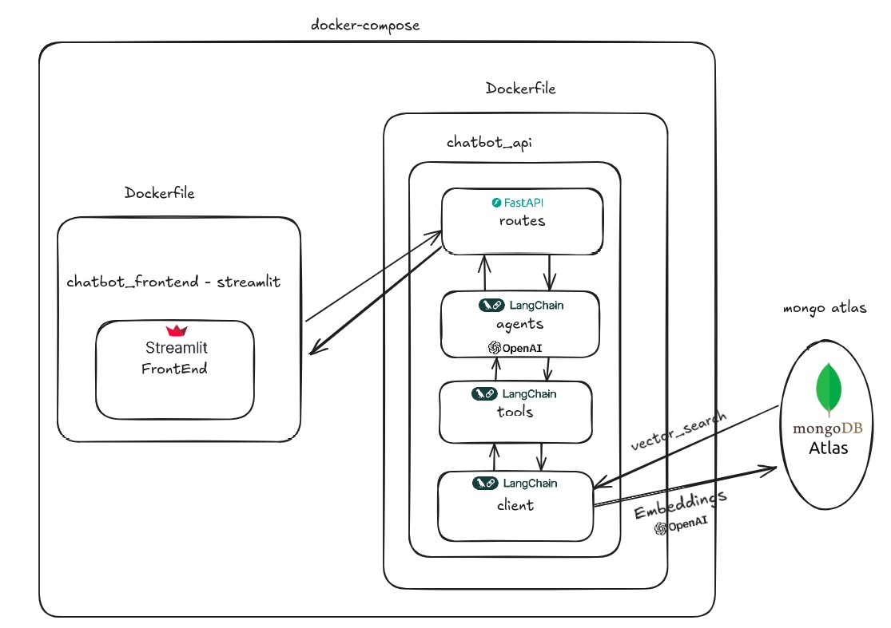

# 1STI SMART Chat 

## Configurar

Crie um arquivo `.env` no diretório raiz e adicione as seguintes variáveis de ambiente:

```.env
OPENAI_API_KEY=<>
AGENT_MODEL=gpt-3.5-turbo-1106

CHATBOT_URL=http://chatbot_api:8000/agent/agent-mongo
ATLAS_CONNECTION_STRING=<url gerada de conexão do mongo atlas>
ATLAS_DB_NAME=<
ATLAS_COLLECTION_NAME=
ATLAS_INDEX_NAME=
```
Depois de preencher todas as variáveis de ambiente e instalar o Docker Compose, abra um terminal e execute:

```console
docker-compose up --build
```
Se precisar derrubar todos os serviços e remove os volumes criados com Docker Compose.
```console
docker-compose down -v
```
Se precisar listar todos contêineres em execução.
```console
docker ps -a
```
Após cada container finalizar a construção, você poderá acessar a API do chatbot em http://localhost:8000/docs e o aplicativo Streamlit em http://localhost:8501/.

Estrutura do proejeto

```console
./
│
├── chatbot_api/
│   │
│   ├── src/
│   │   │
│   │   ├── agents/
│   │   ├── client
│   │   ├── models/
│   │   ├── routes/
│   │   ├── service/
│   │   ├── tools/
│   │   ├── utils/
│   │   └── main.py
│   ├── tests/
│   ├── .env
│   ├── Dockerfile
│   └── requirements.txt
│
├── chatbot_frontend/
│   │
│   ├── src/
│   │   ├── entrypoint.sh
│   │   └── main.py
│   │
│   ├── Dockerfile
│   └── requirements.txt
│
├── tests_integration/
├── .env
└── docker-compose.yml
└── requirements.txt
```

Aqui está uma documentação detalhada dos principais arquivos da sua aplicação:

### Estrutura Geral da Aplicação
A aplicação é dividida em dois principais diretórios: `chatbot_api` e `chatbot_frontend`, com suporte adicional por meio de um diretório de testes (`tests_integration`) e arquivos de configuração como o `docker-compose.yml` e `requirements.txt`.

---

### 1. **Diretório `chatbot_api/`**
Este diretório contém a lógica do backend da aplicação, organizada da seguinte forma:

#### **1.1 `src/`**
O diretório `src` contém todos os módulos principais da aplicação backend, organizados por responsabilidade.

- **`agents/`**: Contém os agentes responsáveis por lidar com consultas específicas. No seu caso, existe um arquivo `mongo_agent.py`, que contém a classe `AgentManagerMongo`. Esta classe gerencia interações com a API do OpenAI para responder perguntas usando recursos HL7 FHIR.
  
- **`client/`**: Este diretório pode conter código relacionado à comunicação com serviços externos (ex.: clientes de banco de dados ou APIs externas). O `AtlasClient` que lida com a conexão ao MongoDB Atlas pode residir aqui.
  
- **`models/`**: Define os modelos de dados e objetos que são utilizados dentro da aplicação, como `QueryInput` e `QueryOutput`. Esses modelos são usados para receber e enviar dados nas rotas da API.
  
- **`routes/`**: Define as rotas FastAPI, incluindo as rotas que invocam os agentes, como a rota `/agent-mongo` que processa consultas MongoDB via OpenAI.
  
- **`service/`**: Provavelmente contém a lógica de serviços que atuam como intermediários entre as rotas e o restante da aplicação, lidando com a lógica de negócios.
  
- **`tools/`**: Contém classes e funções auxiliares para os agentes, como a `ToolDefinition`, que define ferramentas personalizadas usadas pelos agentes LangChain.
  
- **`utils/`**: Este diretório armazena funções utilitárias, como `async_retry` e `url_to_vector`. Essas funções fornecem funcionalidades auxiliares, como tentativas automáticas em caso de falhas e conversão de URLs ou arquivos JSON em vetores.
  
- **`main.py`**: Arquivo principal que inicializa a aplicação FastAPI. Ele configura as rotas, serviços e possíveis middlewares.

#### **1.2 Arquivos Raiz em `chatbot_api/`**
- **`.env`**: Contém as variáveis de ambiente usadas na aplicação, como chaves de API e strings de conexão com o MongoDB Atlas.
  
- **`Dockerfile`**: Define as instruções para criar o contêiner Docker da aplicação backend. Ele instala as dependências, configura o ambiente de execução e inicializa o servidor FastAPI.
  
- **`requirements.txt`**: Lista todas as bibliotecas e dependências Python necessárias para rodar o backend, como FastAPI, pymongo, e pacotes da LangChain.

---

### 2. **Diretório `chatbot_frontend/`**
Este diretório contém a lógica do frontend da aplicação.

#### **2.1 `src/`**
O diretório `src` contém os principais arquivos de execução do frontend.

- **`entrypoint.sh`**: Script de inicialização do contêiner Docker do frontend. Ele provavelmente configura o ambiente, migra bancos de dados ou realiza outras tarefas de setup antes de iniciar a aplicação.
  
- **`main.py`**: Arquivo principal da aplicação frontend, responsável por renderizar as páginas e gerenciar a interface com o usuário.

#### **2.2 Arquivos Raiz em `chatbot_frontend/`**
- **`Dockerfile`**: Define as instruções para criar o contêiner Docker do frontend. Ele instala as dependências e configura o ambiente para o frontend.
  
- **`requirements.txt`**: Lista as bibliotecas e dependências Python necessárias para o frontend.

---

### 3. **Diretório `tests_integration/`**
Este diretório contém os testes de integração para garantir que as diferentes partes da aplicação, como agentes, bancos de dados e rotas, funcionem bem em conjunto.

---

### 4. **Arquivos Raiz da Aplicação**
- **`.env`**: Arquivo de variáveis de ambiente usado tanto no backend quanto no frontend, contendo chaves de API, strings de conexão e outras configurações.
  
- **`docker-compose.yml`**: Arquivo de orquestração de contêineres que define como os contêineres do backend e frontend (e possivelmente outros serviços como MongoDB) serão configurados e executados em conjunto.

- **`requirements.txt`**: Um arquivo na raiz, provavelmente usado para o desenvolvimento geral ou testes, contendo dependências comuns.

---

### **Principais Componentes de Código**

#### **1. Classe `AgentManagerMongo`**
Esta classe gerencia um agente de consulta baseado no modelo OpenAI e LangChain para interagir com um banco de dados MongoDB. Ele usa ferramentas para consultar documentos e processa as respostas geradas.

- **Atributos**:
  - `model`: Modelo OpenAI usado (ex.: `gpt-3.5-turbo`).
  - `tools`: Ferramentas de recuperação como `create_mongo_retriever`.
  - `agent`: Agente OpenAI configurado com um prompt personalizado e ferramentas.
  - `memory`: Histórico de mensagens para a sessão de chat.
  
- **Métodos**:
  - `execute()`: Executa consultas assíncronas ao agente com base no `session_id` e entrada do usuário, retornando as respostas e metadados.

#### **2. Classe `AtlasClient`**
Esta classe gerencia a conexão com o MongoDB Atlas e fornece métodos para interagir com o banco de dados.

- **Atributos**:
  - `mongodb_client`: Cliente MongoDB conectado ao MongoDB Atlas.
  - `database`: Banco de dados selecionado.
  
- **Métodos**:
  - `ping()`: Verifica a conectividade com o MongoDB.
  - `get_collection()`: Retorna uma coleção MongoDB específica.
  - `find()`: Realiza consultas na coleção MongoDB.

#### **3. Classe `ToolDefinition`**
Define ferramentas customizadas que podem ser usadas pelos agentes LangChain para recuperar dados de JSON ou MongoDB e fornecer respostas enriquecidas com metadados.

- **Métodos**:
  - `create_json_retriever()`: Cria uma ferramenta que recupera dados de um arquivo JSON.
  - `create_page_retriever()`: Cria uma ferramenta que busca dados de uma URL.
  - `create_mongo_retriever()`: Cria uma ferramenta para recuperação de dados MongoDB, incluindo metadados.

---

